# Go Live Event Manager 1.0 - Admin

<iframe src="https://player.vimeo.com/video/641301014?h=6a47b306a4&amp;badge=0&amp;autopause=0&amp;player_id=0&amp;app_id=58479" frameborder="0" allow="autoplay; fullscreen; picture-in-picture" allowfullscreen style="position:absolute;top:0;left:0;width:100%;height:100%;" title="user-manual-admin"></iframe>

## **Overview**

The **Go Live Event Manager** is a platform that allows the creation and configuration of live-streaming event pages.

It facilitates collaboration between event producers and clients to create the most stunning, feature rich event pages for viewers to enjoy.

Using a modular component system, within minutes, an event page can be created, configured and ready to stream. 

For a detailed breakdown of the technology behind it please refer to the 

[Technical Manual]: kablamo.com.au

The platform can be accessed at https://events.golive.com.au/

If you need an account please contact: info@golive.com.au

## User Roles

There are three types of users for the platform: Admins, Clients and Viewers.

**Admins**

Mostly, Go Live employees, Admins can create and delete users. 

They can also create events and assign them to clients.

In addition, they can perform all the tasks that a client would.

**Clients**

Clients can configure, preview and publish events created for them by Admins.

**Viewers**

Anyone with a link to a published event page. 

Usually, the audience for an event.

###### Login / Logout

All users login to the platform through the production environment: https://events.golive.com.au/

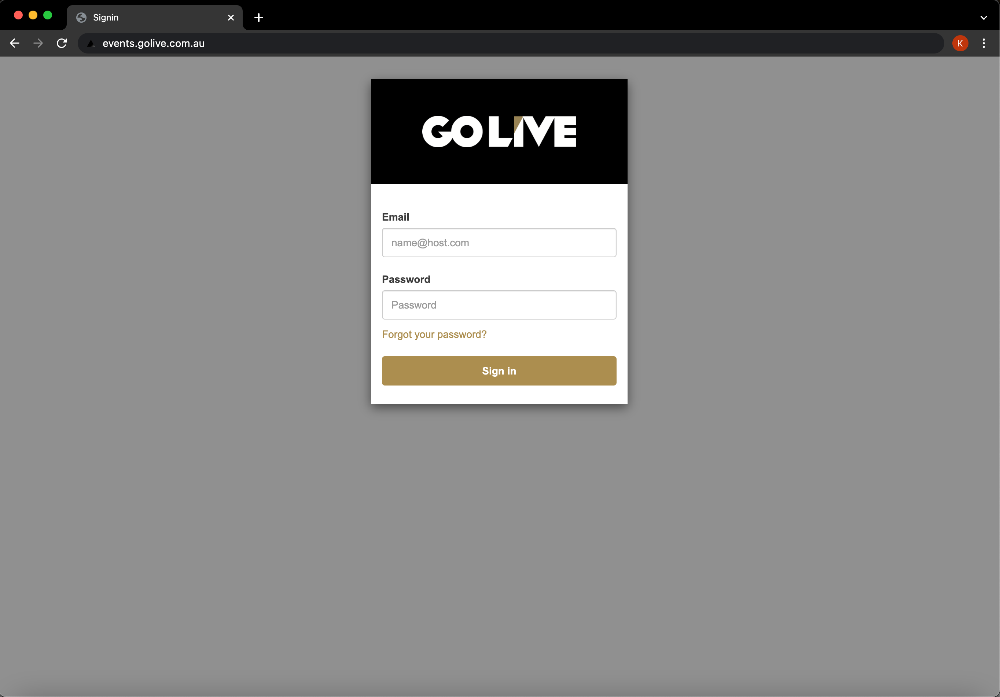

###### Development Environment

An additional development environment exists and it's used for feature building and testing before releasing to production: https://dev-events.golive.com.au/) The user and event data isn't shared across both, but the vimeo account is the same.

# Admin Manual

Admin users have privileges to manage all users and events. 

#### Viewing the Users

The user list can be accessed through the "Manage Users" button

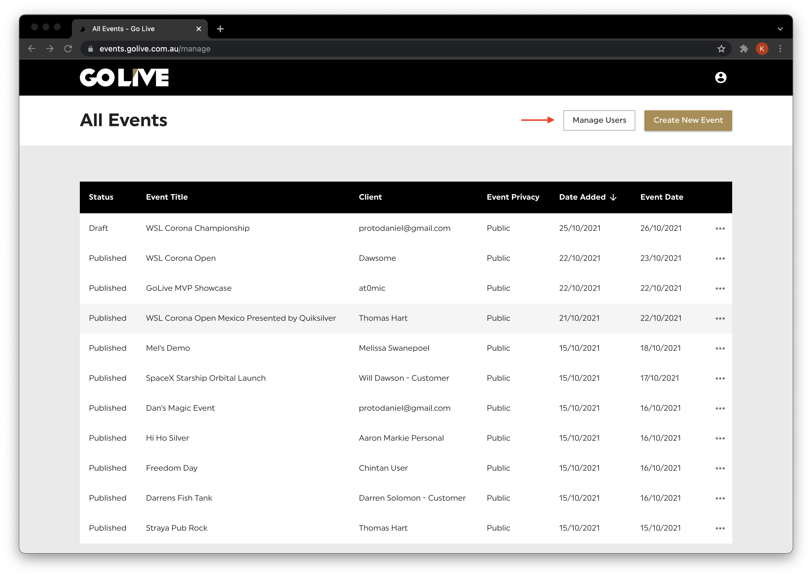

Once pressed, a full list of users is made available:

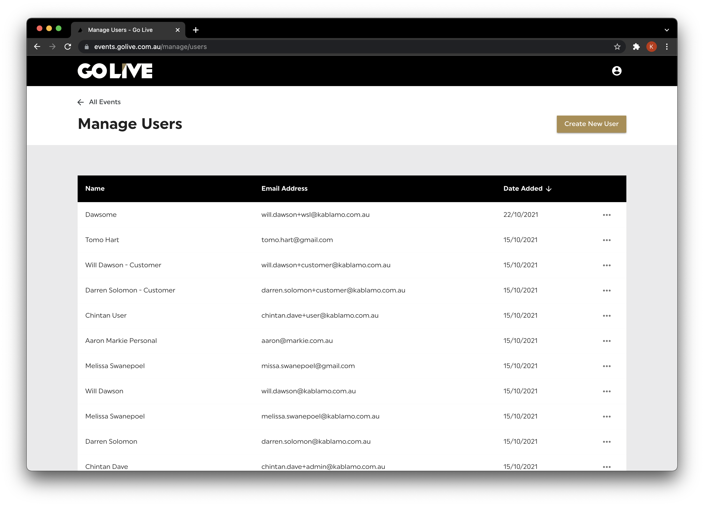

#### Creating a User

New users can be created by clickin on the "Create New User" button

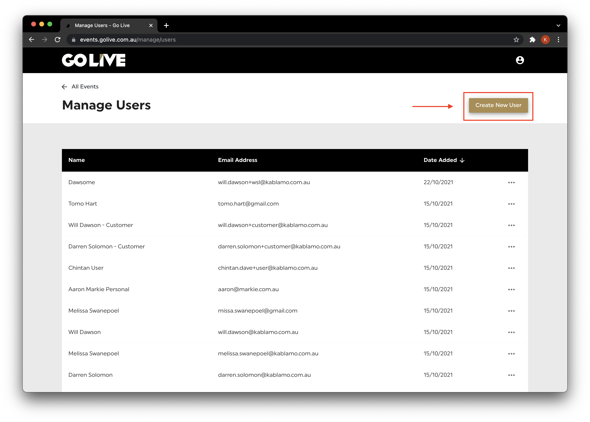

Three parameters are required when creating a new user: Name, Email and Group.

The group selection will determine if a user is an Admin with full privileges or a Customer with limited ones.

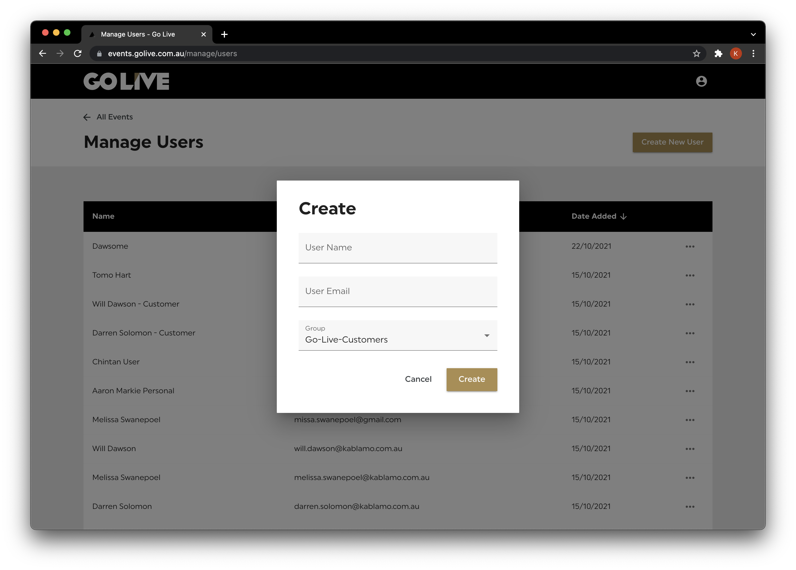

Once a user is created, within seconds, a welcome email will be automatically sent to the email address provided with a confirmation code that the user can then use to set their own password

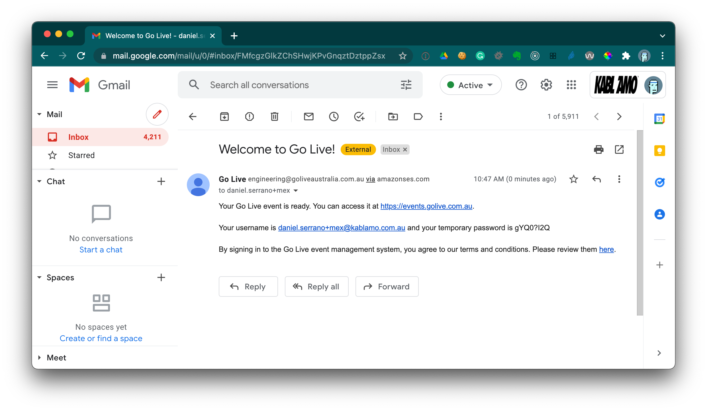

#### Deleting a User

Users can be deleted by clicking on the additional options icon on the user list page and clicking "delete" there is a confirmation screen to confirm the deletion because it can't be undone.

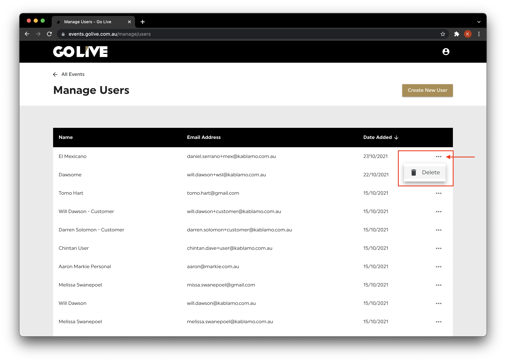

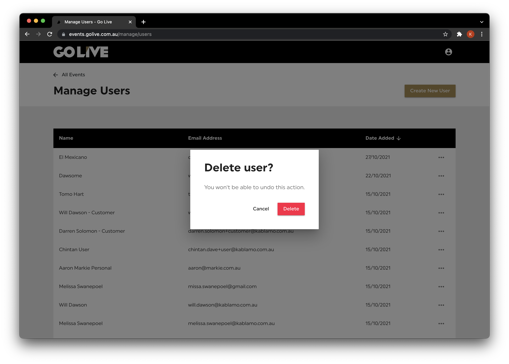

#### Updating a User

While changing the name or email of a user isn't available at the moment, every user can review their information and change the password by clicking on the "Settings" menu.

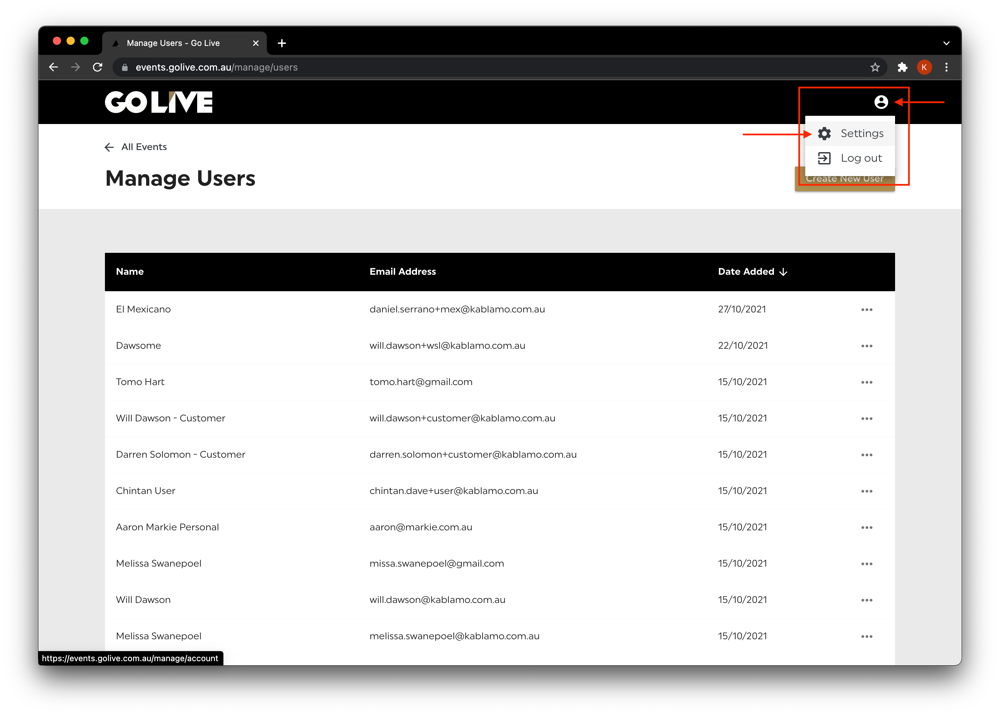

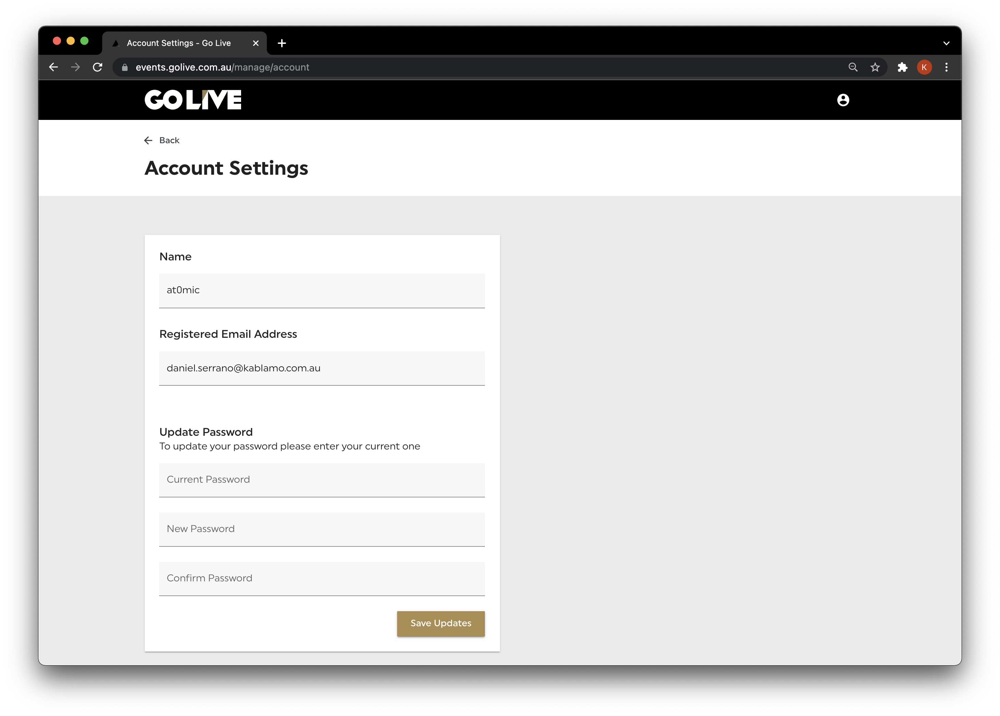

#### Creating an Event

Admin users are responsible for the creation of events for client users and producers to configure. An event can be created by clicking the "Create New Event" button on the main screen, which contains the list of all events in the platform.

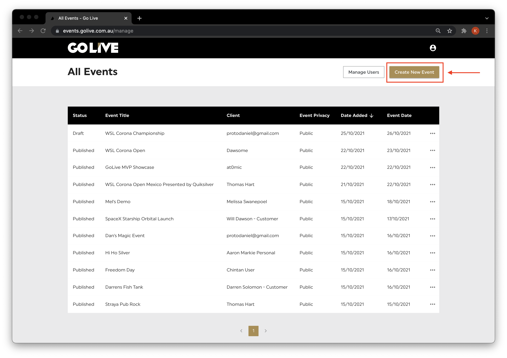

This will open the Event Creation Dialogue. More details about each required field below.

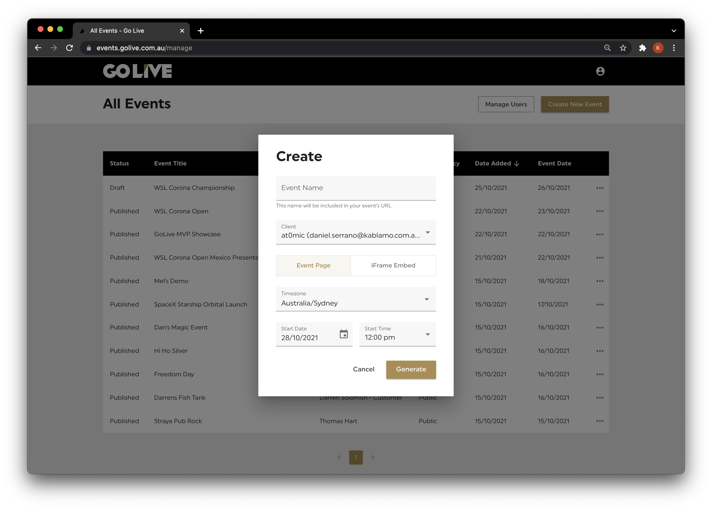

###### Event Name

This is the name for the event in the Event Listing screen. 
The name is also used as the URL for the event page once it's published.

###### Client

The user account that will be able to configure the event. 
Remember that all Admin accounts can configure all the events but Client accounts are only able to see events assigned to them

###### Event Page / iFrame Embed

Not all Events need an event page. 
Sometimes clients just want the ability to embed the player in their own webpage. 
Selecting "iFrame Embed" allows you to create an event where a limited view with the embed code will be made available for the client. 

###### Timezone

The time zone for the event. It is important to notice that when a viewer logs into the event page, all times will be adjusted and displayed in their local system's time.

###### Date and Time

The day and time of the event.

Once an event is created. It will appear in the All Events list for the user it was assigned to. Additionally, all admins will be able to see it. 

It will also create a counterpart within the Vimeo account using the Event Name.
